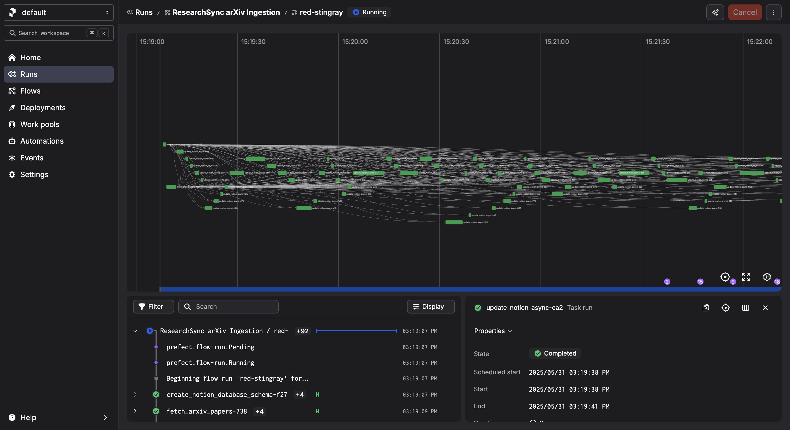

# ReasearchSync

An AI app powered by MCP server using FastAPI, a Prefect workflow to fetch and store paper metadata, and deployed on AWS EC2 with Docker. The papers are stored in Notion Database and Redis for vectorised data.

Python version: 3.11

## System Overview

The system will:

- Monitor arXiv publications from ML/AI related tags (e.g., 'cs.AI').
- Fetch metadata (title, authors, abstract) and add to Notion Database using Prefect workflow.
- Store data in a Notion database.
- Convert the paper's abstract to vector embeddings for fast retrieval and store on Redis.
- Allow an AI assistant to query or manage the database via MCP.

## Prefect Workflow Snippet

## Communication Architecture
┌─────────────────────┐    HTTP Requests     ┌─────────────────────┐
│   Gradio App        │ ─────────────────── │   MCP Server        │
│   (port 7860)       │ ←─────────────────── │   (port 8000)       │
│                     │    JSON Responses    │                     │
│ ResearchPapersClient│                      │ ResearchPapersMCP   │
└─────────────────────┘                      └─────────────────────┘
         │                                              │
         │                                              │
    User Interface                              Backend Processing
    - Search forms                              - Redis Vector DB
    - Data tables                               - Notion API
    - Buttons/inputs                            - Embeddings

